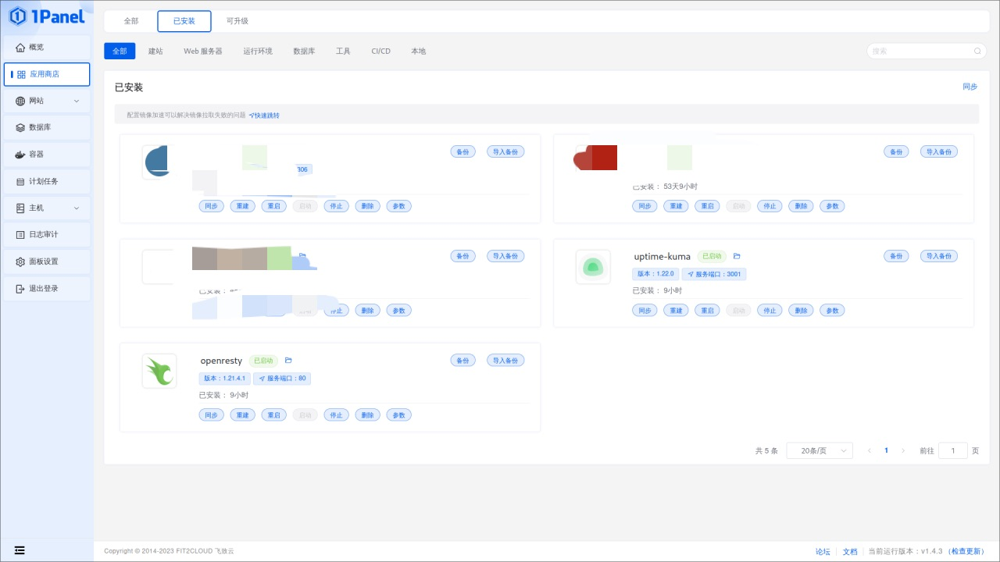
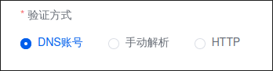
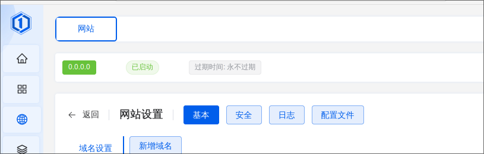
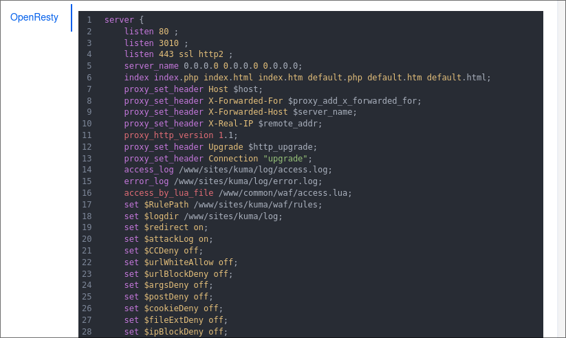
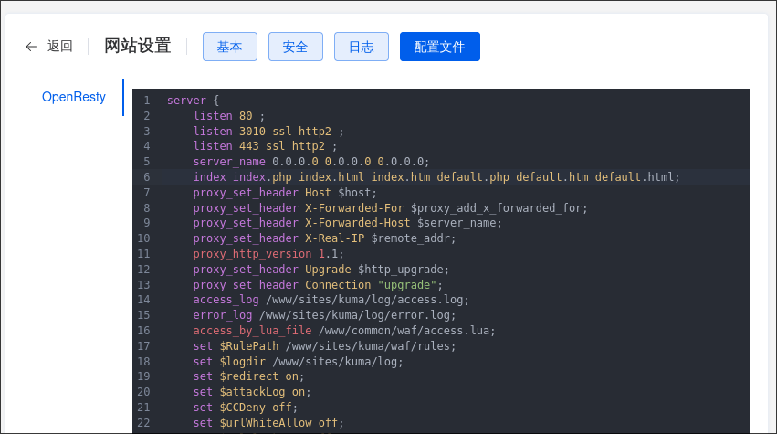
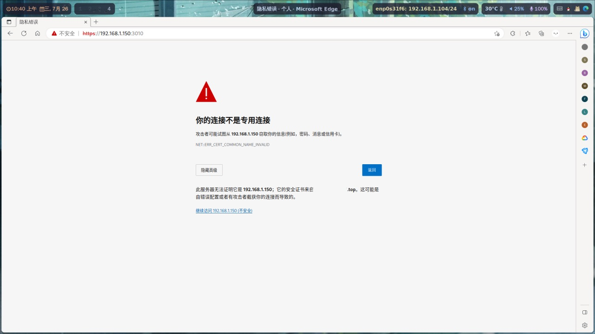
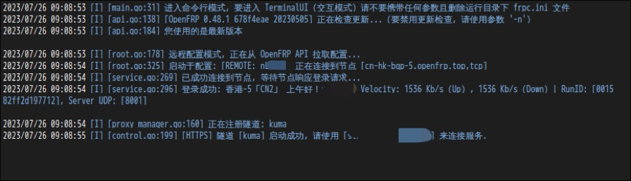
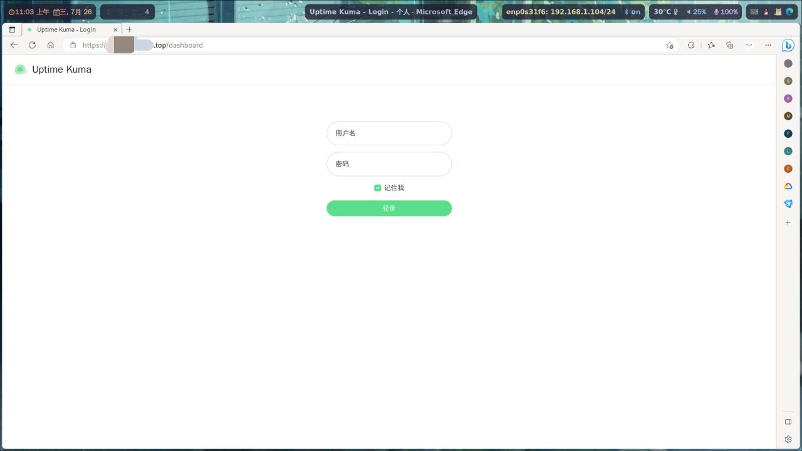

## 前言
在用Vuepress搭建完服务器的文档站后准备搭建一个服务器状态监控站  
静态网页用Uptime Robot的API发现只是tcping,不能监控服务器在线状态  
于是搭建Uptime Kuma监控  
- 本次使用[openfrp](https://openfrp.net/)来实现外网访问
- 环境部署均在1Panel面板进行
## 安装软件
第一步就是安装Uptime Kuma和OpenResty  
登陆1Panel,点击应用商店，找到Uptime Kuma和OpenResty点击安装  
因为是docker容器的安装方式，所以直接安装很快就能完成  

## 配置反代理
Uptime kuma默认端口是3001而且是http，外网访问总显示不安全  
这玩意本来就是给别人看的，所以还是配置下https
### 新建项目
1Panel选择"网站"，点击"创建网站"，选择"反向代理"  
主域名可以随便写，与后续无关，写0.0.0.0都行  
代号的话如果你是写的域名，应该会自动充，写的ip的话就自行修改  
代理地址填写<code>http://0.0.0.0:3001</code>
点击确认就完成项目创建了
### 配置反向代理
找到刚创建的项目，点击"操作"中的"配置"进入配置页面  
域名设置建议新建一个域名+端口。应为我最终是frp实现外网访问，所以填写<code>0.0.0.0</code>端口<code>3010</code>  
后续内网访问可以使用 http://主机地址:3010进入Uptime Kuma,能打开就说明反代理配置完成  
### 配置ssl证书
https肯定还是要一个ssl证书的，1Panel自带Acme一键生成且自动续签  
1Panel点击"证书" 没有Acme账户要创建一个，很简单，输入邮箱就可以了  
然后点击"DNS账户"用于自动验证域名所有权进行DNS认证(不添加也行，可以手动解析验证)  

DNS账号支持添加阿里云，DNSPod和CloudFlare  
完成后点击添加证书，主域名是你后续要外部访问的域名，其他域名顾名思义，按想要添加  
acme账户选择刚添加的  
验证方式按自己需要选择，并选择"自动续签"  
等一会就会有证书已经颁发了
### 配置ssl证书
点击1Panel内的网站，点击"操作"中的"配置"进入配置页面  
点击"Https"，选择"启用Https",Http选项按需要选择  
"ssl选项"选择"选择已有证书"，"Acme账户"选择之前添加的  
"证书"选择刚才注册的，其他的默认就行  
然后点击保存
### 启用https连接

大坑，如果你本地访问不是警告而是停止连接就没有自动配置，需要手动启用https连接

之前我们在"域名设置"里设置了反代理到的域名+端口  
但是如果访问有问题，https连接拒绝，就需要手动改配置文件  
点击"网站设置"旁边的"配置文件"进行编辑  

打开后能看见只为监听的443端口开启了https连接  

因为我们是监听3010端口并开启https,所以在3010端口后内容和443端口一样就行  
就像这样  

点击"保存并重载"，就会发现3010端口已经可以连接并使用https了  

## 配置公网访问 
想要随时可以查看，那就需要映射到公网访问  
这里使用[OpenFrp](https://openfrp.net/)进行映射访问  
### 创建隧道
创建账号实名认证后添加一条非大陆隧道(域名过白后也可以用国内节点)  
"隧道名称"自取，"本地地址"0.0.0.0或者127.0.0.1都行  
"远程端口"不管,"隧道类型"选择"HTTPS隧道"  
"本地端口"填写本地能访问的https的端口  
"绑定域名"填写你注册ssl证书写的域名(必须有)  
其他都不用管，点击提交就创建完成了
### 下载软件
点击右侧的"软件下载"下载对应平台的软件  
因为我是Linux的x86_64平台，就选择Linux并下载amd64版本即可  
按自己系统及平台选择  
### 解压软件
找到下载好的压缩包，使用进行解压  
会看到frpc主程序  
### 启动  
我是frpc端，所以的话用命令行启动  
需要在面板首页获取"访问密钥"，再到"管理隧道"获取隧道ID
输入命令就可启动
```
./frpc_linux_amd64 -u 访问密钥 -p 隧道ID
```
### 域名解析
进入到你的域名DNS管理平台，我这里是阿里云  
添加一条CNAME类型的解析，主机记录填写二级域名，比如我是"status"  
记录值填写frpc启动后给出的节点域名  

其他默认不管
## 结束
到这里应该就可以使用域名随时访问Uptime Kuma了，但是请保持反代理,frpc和Uptime Kuma打开

