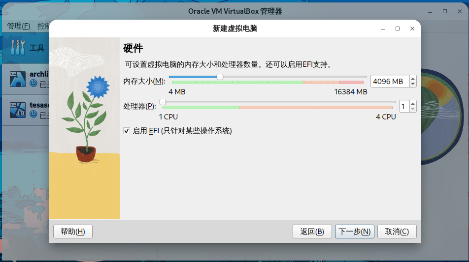
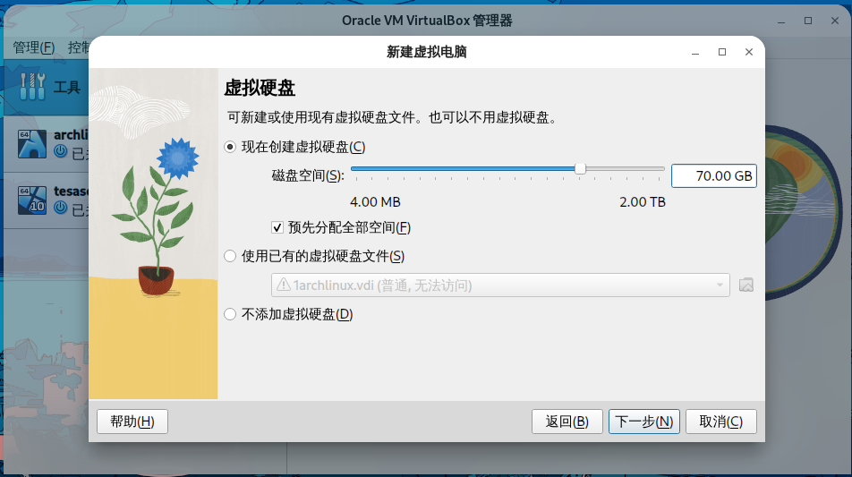
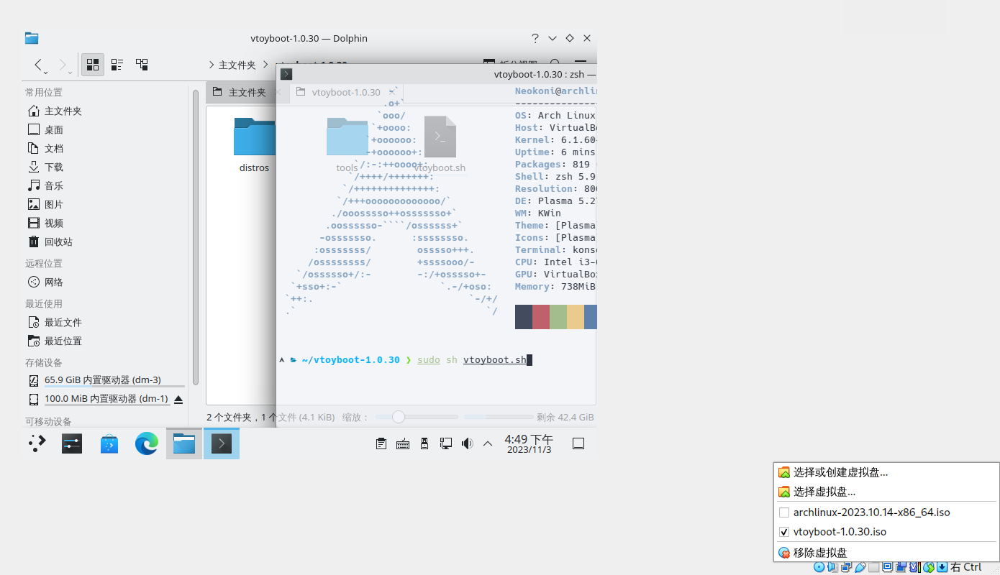

## 前言
在学校机房信息课每次配置环境麻烦，还因为某些东西第一次登陆要手机验证，于是想到了在U盘内安装的系统  
本次安装由Ventoy启动，兼顾linux to go和正常安装其他系统的功能
## 要求
1.一个USB3.x的U盘，最好64G及以上以可以划分足够的剩余的空间，U盘速度越快越好

不要为了价格买便宜的，速度会非常慢  
购买时注意<code>写入速度</code>，商家宣传大多写的读取速度，注意分辨  
不要使用gnome及gdm,实测会导致系统在U盘内启动很慢(GDM及GNOME)  
也有可能是我自己的特殊的奇奇怪怪的问题？

2.一台正常使用的电脑
3.ventoy及virtual box虚拟机  
4.创建虚拟磁盘时选择分配完全部空间
## 虚拟机设置及其他
打开virtual box,点击新建，选择完基本的信息，选择勾选<code>启用EFI</code>，磁盘这里要选择分配全部空间  
我这里就分配70G,剩余空间用来存放东西

之后正常安装ArchLinux或者其他的Linux系统即可

运行grub-install时需要带上<code>--removable</code>参数  
一般像ubuntu这种有图形化安装的都自带  
否则直接从硬盘启动(非GRUB创建的磁盘引导)会报错<code>No bootfile found for UEFI! Maybe the image does not support X64 UEFI.</codee>

## 处理系统及放入U盘
这里需要用到一个对ventoy的处理，[这里](https://www.ventoy.net/cn/plugin_vtoyboot.html)有对处理的解释  
1.到[Vtoyboot](https://github.com/ventoy/vtoyboot/releases)下载vtoyboot文件  
并挂载到虚拟机，复制到主目录解压后，终端内以root权限执行文件夹内的vtoyboot.sh

2.复制虚拟磁盘镜像到U盘的Ventoy分区并改为.vtoy后缀  
  
不出意外的话现在已经可以从U盘启动Linux了，此方法适用于大多数Linux系统
## 相关链接
[Ventoy下载](https://www.ventoy.net/cn/download.html)  
[Virtual Box下载](https://www.virtualbox.org/wiki/Downloads)
[vtoyboot脚本](https://github.com/ventoy/vtoyboot/releases)
[Wallpaper](https://m.joyreactor.cc/post/5515432)