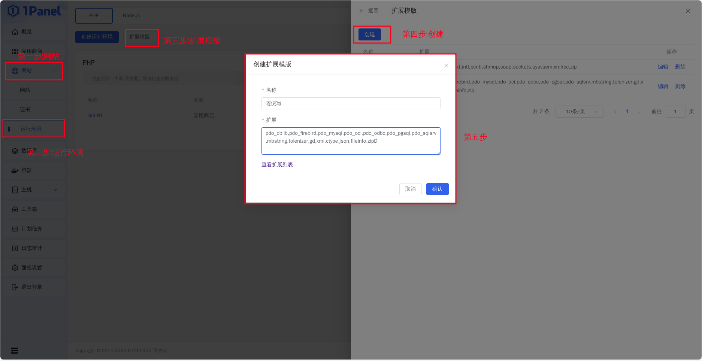
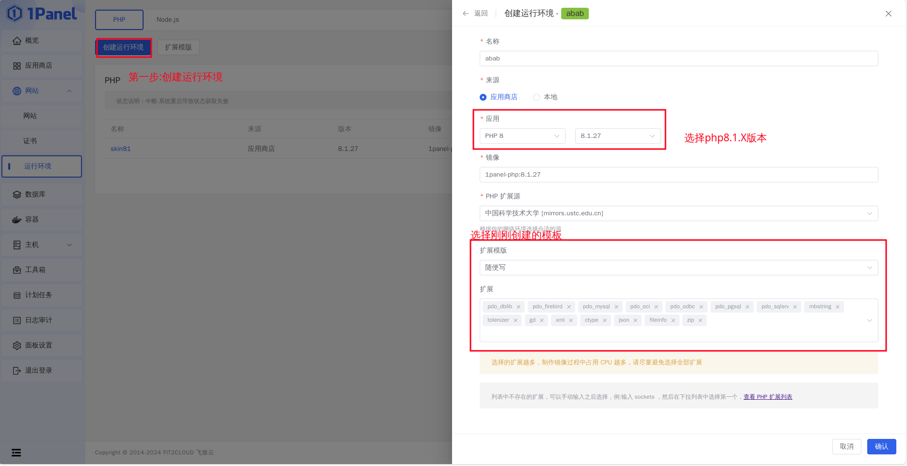
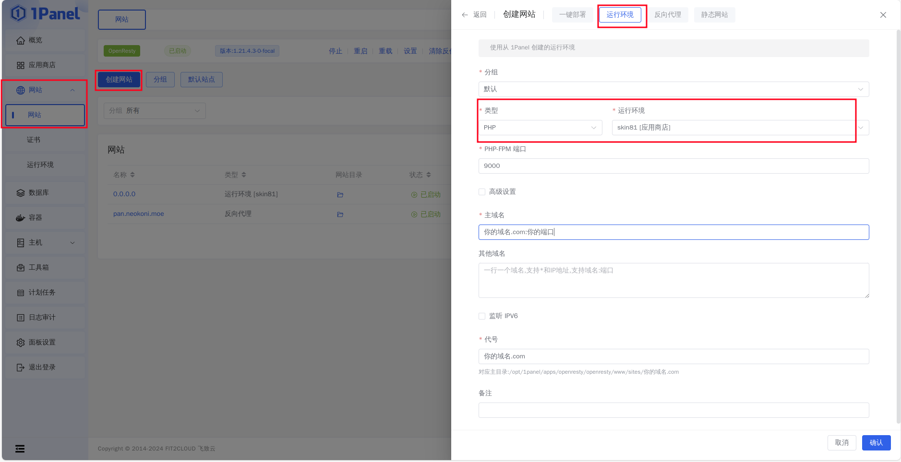
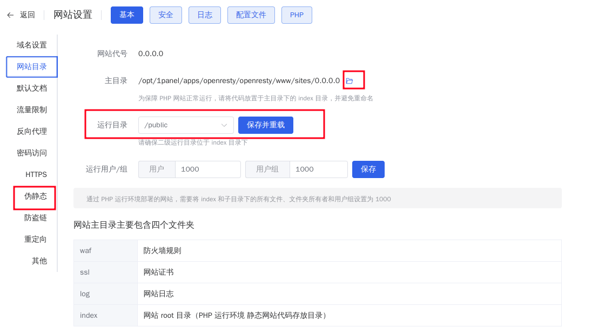
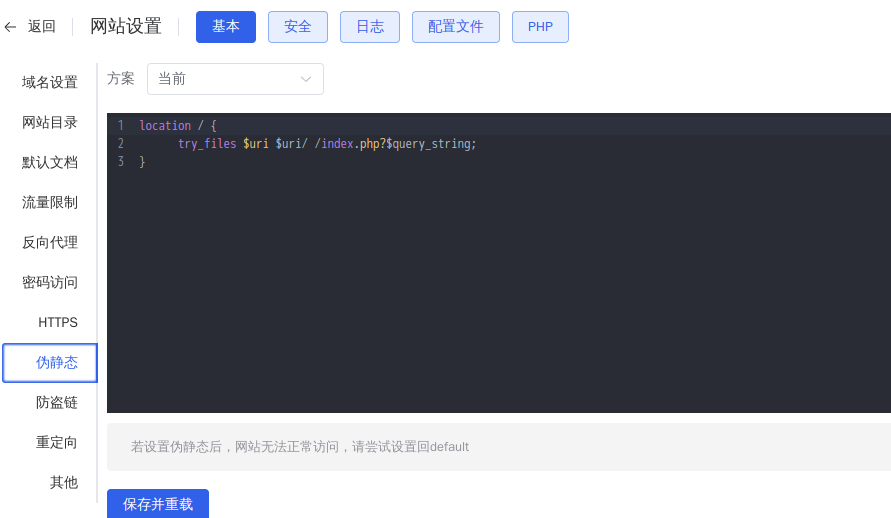

## 实现效果
服务器与客户端均不使用外置登陆，服务器为离线模式，可自行选择使用mojang的皮肤或使用皮肤站定义的皮肤
## 需要的插件或环境
- [1Panel](https://1panel.cn/)
- 为插件的Minecraft核心或代理
- [SkinsRestorer](https://skinsrestorer.net/)
- [UseBlessingSkin](https://github.com/hank9999/UseBlessingSkin)
- php8.1环境(1Panel安装)
- 数据库(MySQL等)
## 部署皮肤站
### 安装1panel
使用[1Panel](https://1panel.cn/)提供的一键安装脚本一键安装，安装时会自动安装docker
### 使用1panel部署php环境
选择网站->运行环境->扩展模板->创建，创建一个扩展模板，名字可以随便取，"扩展"内填入以下内容，图中末尾多写了个"D"
```
pdo_dblib,pdo_firebird,pdo_mysql,pdo_oci,pdo_odbc,pdo_pgsql,pdo_sqlsrv,mbstring,tolenizer,gd,xml,ctype,json,fileinfo,zip
```
这一步主要是因为创建环境时的扩展并不能批量导入，只能使用扩展功能  
当然，你也可以手动输入（

接着返回"创建运行环境"来创建一个php8.1的环境，并选择刚刚创建的模板，点击创建，等待创建完毕


不要选择更高的版本！blessing skin可能会不支持，导致运行blessing skin的安装页报错500！  
详情查看[issue区](https://github.com/bs-community/blessing-skin-server/issues?q=is%3Aissue+500)

### 获取blessing skin server
打开[blessing skin server](https://github.com/bs-community/blessing-skin-server/releases/latest)的release，并下载最新版本  

你应该下载文件名类似 <code>blessing-skin-server-xxx.zip</code>的文件，而不是下载<code>Source Code</code>。

### 创建网站
转到网站->网站，创建网站，选择运行环境，类型php,运行环境选择之前创建的环境，域名看实际情况填写，内网的话0.0.0.0都行，可以指定端口

接着配置刚创建的网站，点击网站目录，打开主目录的文件夹，在<code>index</code>文件夹里上传blessing skin server的压缩包并解压。  
接着回到网站设置->网站目录，更改为<code>/public</code>文件夹  
接着点击<code>伪静态</code>并填入以下规则
```
location / {
      try_files $uri $uri/ /index.php?$query_string;
}
```
点击保存并重载


### 初始化blessing skin
不出意外，访问你的主机ip(端口)就可以看到皮肤站的安装页面，按照提示完成即可  
皮肤站需要连接数据库  

如果数据库也是在1panel安装的，请在填写数据库地址一栏使用1panel中的连接信息中的内部连接地址，而不是本机主机ip或本地ip

## 使游戏离线使用皮肤站皮肤
选择皮肤类似于skinsrestorer的那种，但是指令为bskin
### 安装服务器插件
下载[UseBlessingSkin](https://github.com/hank9999/UseBlessingSkin/releases/latest)和[SkinsRestorer](https://skinsrestorer.net/)并放入服务器或代理端的plugins文件夹并使用插件管理插件加载或重启服务端或代理  
在useblessingskin配置文件中，将开头的<code>csl</code>,<code>ctexture</code>,<code>url</code>更改成你自己或别人皮肤站的域名，不要更改后面的内容，将<code>name</code>改成你自己的皮肤站名称(似乎不改也不会怎样)  
其他选项按自己情况更改  
### 服务器中应用皮肤
UseBlessingSkin并不会像Skinsrestorer一样自动应用皮肤，您需要自行使用<code>/bskin set 玩家名</code>设置皮肤，玩家名为您在皮肤站的档案里的玩家名  
UseBlessingSkin的皮肤使用后会覆盖Skinsrestorer的皮肤，并不会和Skinsretorer"打架"