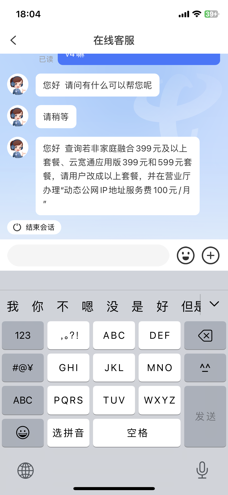
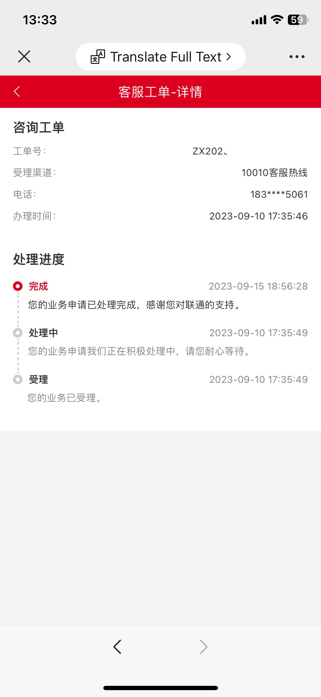
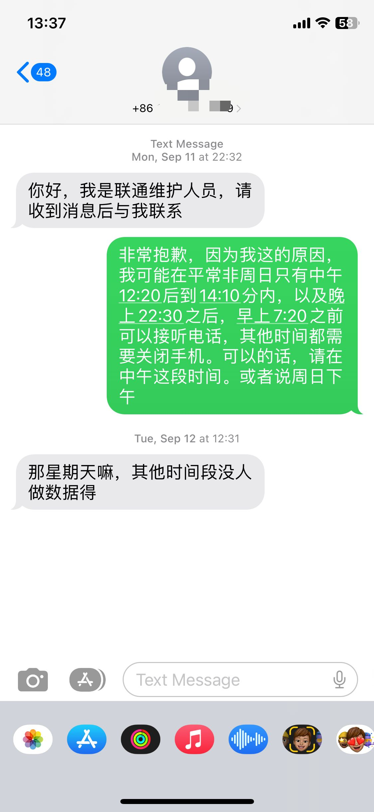
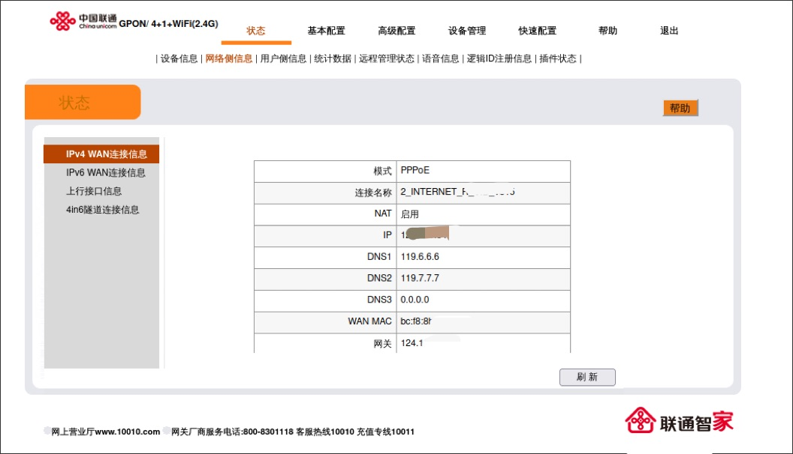
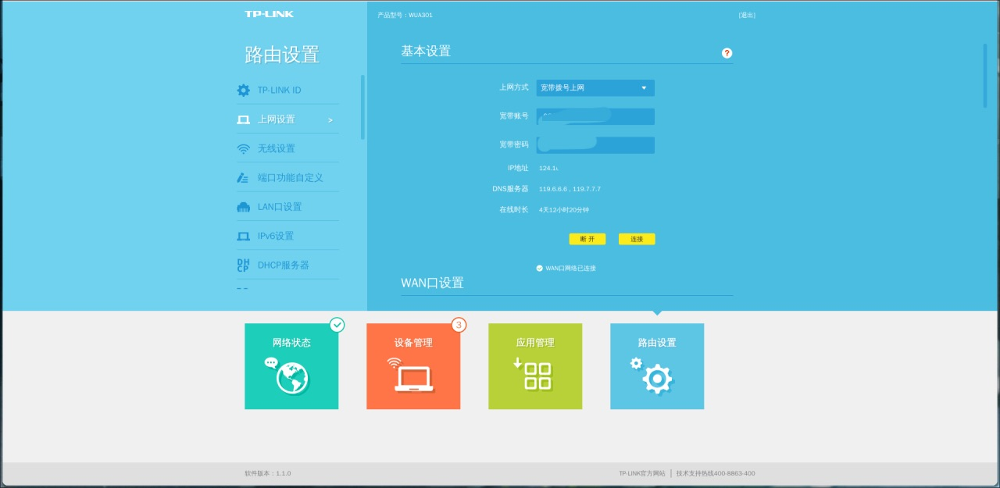

## 前言
今年的8月30日下午，开学的前一天，脑子一抽想再看下公网ip有没有戏。  
移动广电没想过，都说移动很难搞或者像大多数根本不给，广电更难说，以前问的直接说只能开专线  
再想到说电信早更改政策了，免费是不可能滴了(即使有人还尝试让我看下)  
所以最终选择了查询下联通

## 询问

最好还是电话客服，在线客服并没有电话客服熟悉业务  
电话客服有些也会套话术，比如"目前全球的ipv4地址都已经枯竭不拉布拉布拉"，直接换一个问即可

刚开始我只是下载<code>中国联通</code>客户端并在那询问，等的比较久，而且似乎并不是很熟悉这一方面，说他们那是无法查询这一块的  
然后跑去看了下网页上的客服(应该和软件的差不多)，遇到个熟悉的，说了下区域他那边查了一下说没问题的，可以开  
我还问"有没有像电信那样，要指定价位以上的套餐然后有额外收费之类的"，也回答没问题  
我还有点不信，晚点又打电话问了下，可以
## 办理
在办理之前有在手机App上联系最近的官方营业厅问下套餐，套餐对我来说刚好，价格至少比我买云服务器做<code>内网穿透</code>便宜  
然后在开学后的第二个周末就去携号转网+办理宽带了(携号免安装调试费还送流量这些)  
一切办完后因为我赶时间说了一声，宽带师傅也很快来了，半个小时以内
## 申请动态公网ipv4
下午5点多要走了才想起申请公网，打了个电话给10010转人工客服，说明了下申请动态公网ipv4，说给我反馈了下就让我等电话了。  
此时手机收到一条报障短信且提示微信关注XXX可以查看进度

可能是比较晚，联通那边等到第二天才给我回电话
## 波折
因为上学的原因，我手机必须关机，这使我错过了联通那边的电话  
星期一中午一看，一堆未接，我尝试打回，但是没人接，只能晚上再试。晚上一开机，有是一堆未接电话，并且带一条短信

我对此非常抱歉  
当然，第二天中午一开机，仍然一堆未接电话，但是好在这次打过去有人接听了  
我说明了下情况，他也确定了我是那个要开公网的。刚开始还说周末吧，说要怎样怎样，我问道流程时他说那边改完要改一下光猫上网的<code>VLAN ID</code>  
我想这不对口了嘛，直接说这个没问题，我能进光猫超级账户后台。他这听到后直接就谈成了下午就改，方便说改成什么，我们加了下微信

这里得给南充联通点个赞，没有问为什么，也没多层转接询问。直接开通了。

## 设置光猫
晚上到家，发现家里的联通宽带上不了网了，登陆光猫后台，拨号显示"ISP服务器认证失败"  
联通那边微信上说把VLAN ID从原来的XX改成XX，然后拨号  

超级账户登陆页: <code>http://192.168.1.1/cu.html</code>
超级账户密码: <code>CUAdmin</code>
这里的更改VLAN ID是在上网的那个网络设置里的

更改后保存，等待拨号成功，片刻后，ip地址就已经从原来的100.xx.xx.xx变成了正宗的公网ip

## 更改桥接
测试发现光猫的<code>虚拟服务器</code>似乎并不能用，因此要想公网访问只能使用运营商这个合约购买的Tp-Link路由器(已经是家里最好的了)  

不要在无线桥接下Tp-Link设置宽带拨号，根本不行！

改桥接还是一样，到超级后台找到<code>连接模式</code>改为"桥接"  
路由器上网设置改为"宽带拨号上网"即可  
片刻之后，当获取到ip,即完成了所有步骤

## 吐槽
非常好Tp-Link这个路由器，使我的iPv6地址消失  
我测试过Openwrt的固件，可以正常获取ipv6  
问为啥不用Openwrt的那个，Openwrt转发端口返回的是Openwrt的iP地址，而不是真实的访问者ip。实在找不到解决办法，只能忍受这个Tp-Link

