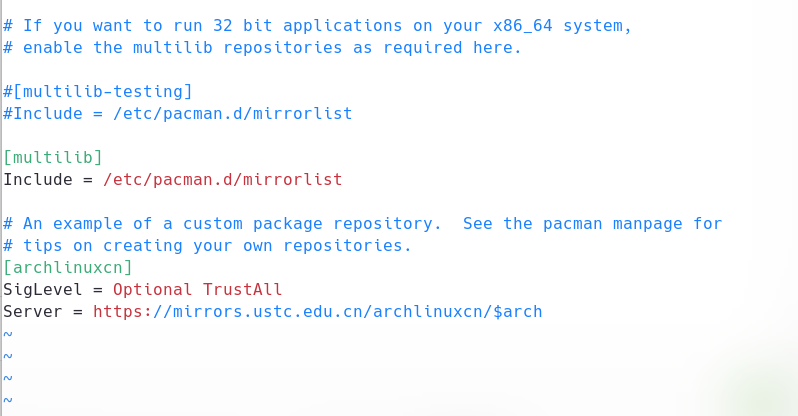
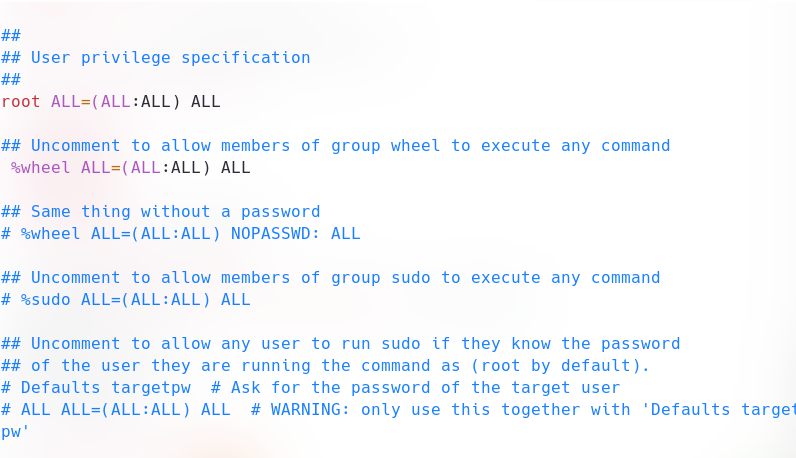

# 记录一次ArchLinux的重装
## 前言
1.虽然一般都是用的普通内核或者zen的内核(听说也可加点性能)，但我有点厌倦了普通内核的快速更新，so,本次内核使用的lts长期支持版内核。  
2.我为什么记录？有些东西不是很好找，比如某个主题，随便也当写个教程  
3.本文章适用于UEFI启动，非传统BIOS。显卡是amd的(F**k U nvidia),有线网络连接  
∴这个文章亦可以当教程看，也是一步一步跟着wiki来的  
吐槽一句:archlinux的中文wiki在某些地方与其他语言不一样，比如timedatectl和pacstrap  
## 一些可以说是初始化的步骤
### 1 )确认下联网

ping bing.com
  
能正常上网就继续吧
### 2 )同步时间
错误的系统时间会带来一些问题，所以最好同步一下时间  

timedatectl set-ntp true

## 2.挂载硬盘
UEFI启动的linux至少有个启动分区，还有个根目录分区(挂载点/)。选加swap和home,但我推荐还是有
### 先用lsblk查看一下硬盘分区

lsblk
  
比如说我的分区就是这样

NAME        MAJ:MIN RM   SIZE RO TYPE MOUNTPOINTS
sda           8:0    0 465.8G  0 disk 
├─sda1        8:1    0    90G  0 part 
└─sda2        8:2    0 375.8G  0 part 
sdb           8:16   0 465.8G  0 disk 
├─sdb1        8:17   0   300M  0 part 
├─sdb2        8:18   0    10G  0 part 
├─sdb3        8:19   0    57G  0 part 
└─sdb4        8:20   0 398.5G  0 part 
sdc           8:32   1  57.7G  0 disk 
├─sdc1        8:33   1  57.6G  0 part /run/media/sekaom/sekaom-U
└─sdc2        8:34   1    32M  0 part 
nvme0n1     259:0    0 238.5G  0 disk 
├─nvme0n1p1 259:1    0   300M  0 part 
├─nvme0n1p2 259:2    0 188.2G  0 part 
└─nvme0n1p3 259:3    0    50G  0 part 
  
我要安装的硬盘在是sdb的那块

### 分区
2TB以下可以使用cfdisk进行分区，我的500G用也刚好  

多硬盘使用cfdisk时需要指定要分区的硬盘，不然默认会打开lsblk里的第一块硬盘
  
比如

cfdisk /dev/sdb
 
### 格式化分区
linux还是老几样的文件系统，boot的fat32,常见的ext4

mkfs.fat -F 32 /dev/sdb1 #格式化为fat32文件系统，"/dev/sdb1"换成你自己需要的
mkswap /dev/sdb2 #格式化为交换分区，"/dev/sdb2"改成你自己的
mkfs.ext4 /dev/sdb3
mkfs.ext4 /dev/sdb4 #格式化更目录和home分区，还是按自己需要改
 
### 挂载
### 第一步是挂载根目录，此后才可以挂载其他的分区，比如boot和home 

mount /dev/sdb3 /mnt #挂载根目录
 
### 为其他挂载点创建文件夹  

mkdir -p /mnt/home #创建home分区的挂载点
mkdir -p /mnt/boot/efi #创建boot分区的挂载点，也可以是/mnt/boot
 
### 接下来依次挂载

mount /dev/sdb4 /mnt/home #挂载home
mount /dev/sdb1 /mnt/boot/efi #挂载boot
swapon /dev/sdb2 #启用swap分区
 
再次运行lsblk你就会发现已经挂载了

NAME        MAJ:MIN RM   SIZE RO TYPE MOUNTPOINTS
sda           8:0    0 465.8G  0 disk 
├─sda1        8:1    0    90G  0 part 
└─sda2        8:2    0 375.8G  0 part 
sdb           8:16   0 465.8G  0 disk 
├─sdb1        8:17   0   300M  0 part /mnt/boot/efi
├─sdb2        8:18   0    10G  0 part [SWAP]
├─sdb3        8:19   0    57G  0 part /mnt
└─sdb4        8:20   0 398.5G  0 part /mnt/home
sdc           8:32   1  57.7G  0 disk 
├─sdc1        8:33   1  57.6G  0 part /run/media/sekaom/sekaom-U
└─sdc2        8:34   1    32M  0 part 
nvme0n1     259:0    0 238.5G  0 disk 
├─nvme0n1p1 259:1    0   300M  0 part 
├─nvme0n1p2 259:2    0 188.2G  0 part 
└─nvme0n1p3 259:3    0    50G  0 part
 
## 换源
默认的镜像源位于国外，下载速度也非常不乐观，所以要换成国内源  
输入以下命令就能编辑镜像文件

vim /etc/pacman.d/mirrorlist

按下"A"键就进入了编辑模式  
因为文件是从上往下检索的，所以直接编辑最上面的那个镜像源就行了  
请确保第一个镜像源是，被注释的内容是蓝色的  

Server = https://mirrors.bfsu.edu.cn/archlinux/$repo/os/$arch
  
我个人喜欢用北外源  
按下"ESC"键再按下"Shift"键输入":wq"就可以保存并退出了  
## 安装软件包
### 安装archlinux-keyring

pacman -Sy
pacman -S archlinux-keyring
 
这一步不知道从什么时候成了需要，不装上的话pacstrap有些包可能会校验失败
### 正式安装
人们总喜欢在这里只安装基本包，但我喜欢这里能装的都装上  
这里是官方wiki上的  

pacstrap /mnt base linux linux-firmware
 
有点少，所以下面这个是某乎教程上的包  

pacstrap /mnt linux linux-firmware linux-headers base base-devel vim git bash-completion
  
我说过，我喜欢在这里装很多的包,而且我说了我要lts内核，接下来是我常用的  
tips：桌面环境为gnome,别的请自行替换

pacstrap /mnt base linux-lts linux-lts-headers linux-firmware base-devel \
        neovim iwd networkmanager ttf-dejavu sudo bluez nano usbmuxd dhcpcd \
        ntfs-3g wqy-zenhei grub efibootmgr jdk17-openjdk jdk8-openjdk intel-ucode amd-ucode \
        pulseaudio xorg pacman gnome fcitx5 fcitx5-chinese-addons fcitx5-gtk fcitx5-qt fcitx5-configtool \
        zsh zsh-autosuggestions zsh-syntax-highlighting zsh-theme-powerlevel10k zsh-completions 
 

## 生成fstab文件
### what's fstab?
fstab是linux下记录挂载的文件系统的文件，linux会在开机时依次挂载
### 生成
ArchLinux为我们提供了生成fstab的脚本，运行以下命令就会自动生成

genfstab -U >> /mnt/etc/fstab
 
至此第一阶段的安装就算完成了  
输入一下命令进入第二阶段的安装

arch-chroot /mnt
 
## 链接vim
如果你使用的是我的pacstrap包，如果不是，请忽略这一步  
我们安装的是neovim,启动命令是nvim,为了方便，我们可以软连接一下

ln -s /bin/nvim /bin/vim
ln -s /bin/nvim /bin/vi
 
## 设置时区
不出意外的话，咱们应该是在中国吧？  
所以这里照样以上海举例(别怀疑，就是上海)

ln -sf /usr/share/zoneinfo/Asia/Shanghai /etc/localtime 
hwclock --systohc
 
## 设置语言
这里涉及两个文件"/etc/locale.gen"和"locale.conf"
至于locale.gen，使用以下命令编辑  

vim /etc/locale.gen
 
这里有很多标准，我们只需要管下面的这几个  
这次不用按"A"，按下"X"就可以删除指向的字符

en_US.UTF-8 UTF-8  
en_US ISO-8859-1
zh_CN.GB18030 GB18030  
zh_CN.GBK GBK  
zh_CN.UTF-8 UTF-8  
zh_CN GB231
 
照样按"Shift"后输入":wq"保存并退出  
运行下面的命令就可以启用刚才的配置了  

locale-gen
 
然后再设置下语言  

echo LANG=en_US.UTF-8 >> /etc/locale.conf
 
不要疑问，就是英文。控制台下不要设置中文，会乱码！
## 设置设备名
最直观的就是bash显示的这个  
  
输入下面的命令就可以设置了，"archlinux"可以换成你准备用的  

echo "archlinux" >> /etc/hostname
 
## 添加用户以及设置hosts文件
archlinux默认只有一个root账户，但这显然是不安全的  
使用下面的命令添加一个用户，"sekaom"可以换成你的

useradd -m -G wheel -s /bin/zsh sekaom  #如果使用bash就将zsh换成bash
 
然后就是设置hosts文件  
输入以下命令编辑hosts文件

vim /etc/hosts
 
输入以下内容，"sekaom"换成你自己的用户名

127.0.0.1 localhost
::1 localhost
127.0.1.1 sekaom.localdomain sekaom
 
## 设置pacman.conf
这里我们将会设置两个东西，一个是archlinuxcn,另一个是系统对32位包的支持

vim /etc/pacman.conf
 
找到最后一部分，去掉multilib的注释，然后设置成如图

然后更新下源

pacman -Syyu
pacman -S archlinuxcn-keyring
 
## 安装aur管理器
aur有很多用户上传的包，也算arch系发行版的特色，使用下面的命令安装yay

pacman -S yay
 
## 设置sudo
不设置不能正常使用sudo,设置也很简单
编辑/etc/sudoers    
取消注释掉下面这一行的内容就可以了

%wheel ALL=(ALL:ALL) ALL
 
大概就这个样子  

保存退出即可
## 设置开机启动的服务
保存这些设置可以让他们开机后自动启动，以免造成一些功能的无法使用

systemctl enable systemd-resolved.service
systemctl enable bluetooth.service
systemctl enable NetworkManager
systemctl enable dhcpcd
systemctl enable gdm
 
## 设置fcitx5的环境
我们使用fcitx5在linux输写中文，这里可以顺便配置一下  
可跳过  
将下面内容添加到/etc/environment即可  

GTK_IM_MODULE=fcitx
QT_IM_MODULE=fcitx
XMODIFIERS=@im=fcitx
INPUT_METHOD=fcitx
SDL_IM_MODULE=fcitx
GLFW_IM_MODULE=ibus
 
## 设置开机引导
不设置开机引导可是无法进入系统的  
这里使用grub进行引导，pacstrap已经安装了  
/dev/sdb1是你的引导分区，按需求改

grub-install --target=x86_64-efi --efi-directory=/dev/sdb1 --bootloader-id="Arch Linux"
grub-mkconfig -o /boot/efi/grub/grub.cfg  #生成配置文件，"/boot/efi"按需要改

## 设置密码
这里包括root账户密码和个人账户密码  
使用passwd进行设置，也可以进行更改  

passwd root  #设置root账户密码
passwd sekaom  #设置个人账户密码，"sekaom"改成自己的用户名
  
## 重启
到此ArchLinux就算安装完了，输入exit就退出了arch-chroot环境  
再输入reboot就重启了！基本的系统就已经安装完成啦！   
